## STEMM Lab

### Context-Aware Mobile Learning Platform for Experiential STEM Education

Production-oriented React Native mobile application integrating offline-first synchronization, Firebase cloud services,
SQLite persistence, real-device capabilities, asynchronous runtime orchestration, and interactive STEM experimentation
workflows.


---

### Overview

STEMM Lab is a mobile learning platform designed to support experiential STEM education through structured
experimentation workflows, context-aware mobile computing, cloud synchronization, and offline-first persistence.

The application was engineered using React Native, Expo, TypeScript, Firebase, and SQLite to provide a modern mobile
laboratory environment where students can complete guided scientific activities, collect real-world data, receive
contextual feedback, and safely preserve their work under unstable network conditions.

Unlike a simple educational prototype, STEMM Lab was developed with a production-oriented architecture focused on
maintainability, synchronization reliability, modular service separation, asynchronous runtime coordination, and
real-device deployment readiness.

The system integrates Firebase Authentication, Cloud Firestore, Firebase Storage, SQLite local persistence, offline
submission queues, background synchronization, local notifications, battery-awareness optimization, visualization
analytics, reflection quality validation, administrative dashboards, and Android APK deployment workflows.

---

### Application Preview

#### Main Application Flow

| Home Dashboard                                                      | Activity Catalog                                                             |
|---------------------------------------------------------------------|------------------------------------------------------------------------------|
| 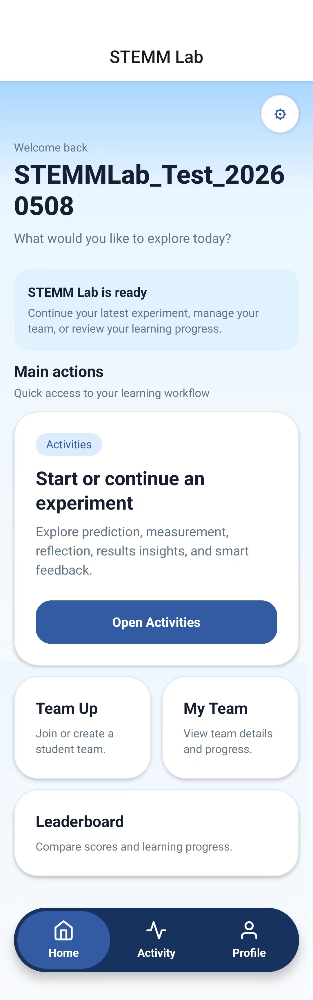 | 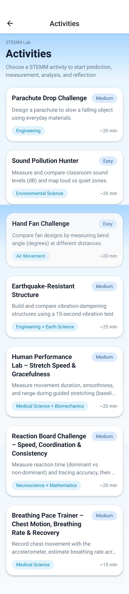 |

| Activity Workflow                                                                    | Experimental Analytics                                                          |
|--------------------------------------------------------------------------------------|---------------------------------------------------------------------------------|
| 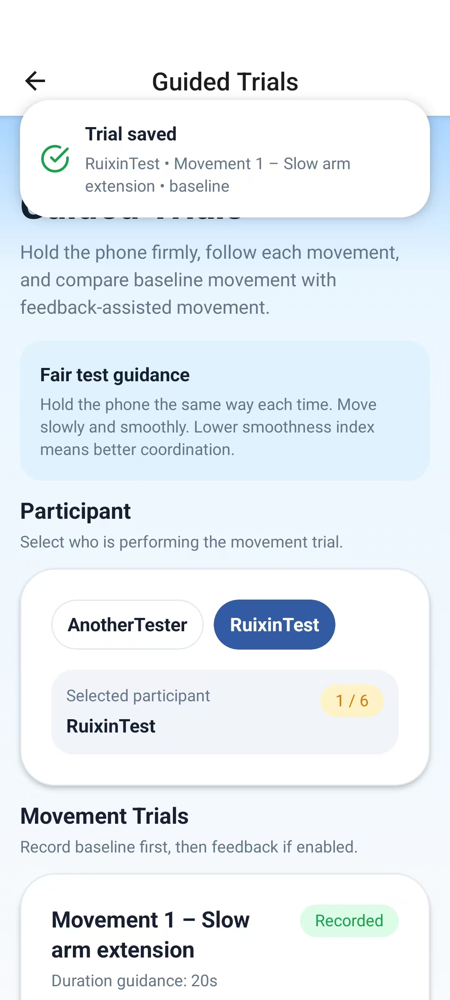 | 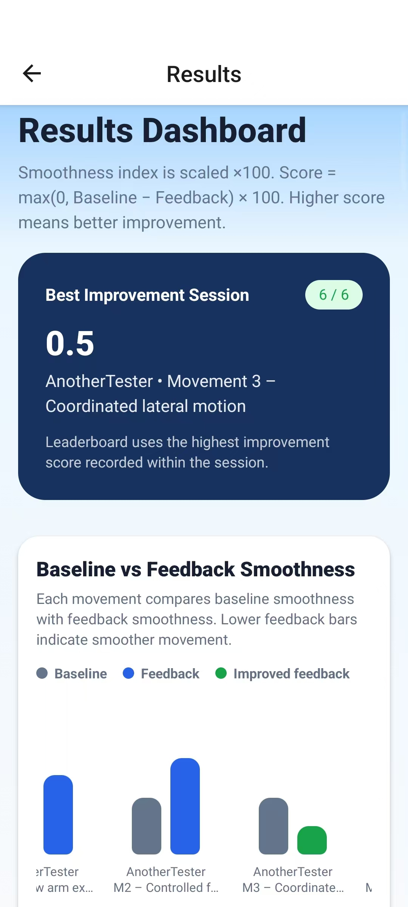 |

#### Smart Feedback and Reflection Validation

| Smart Insight Engine                                                                   | Accepted Reflection                                                                                     |
|----------------------------------------------------------------------------------------|---------------------------------------------------------------------------------------------------------|
| 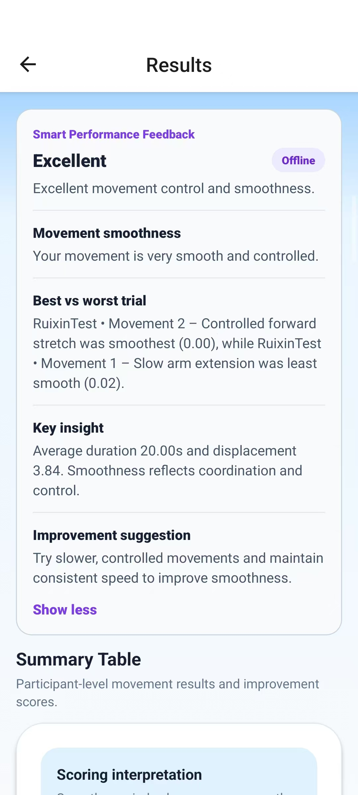 | 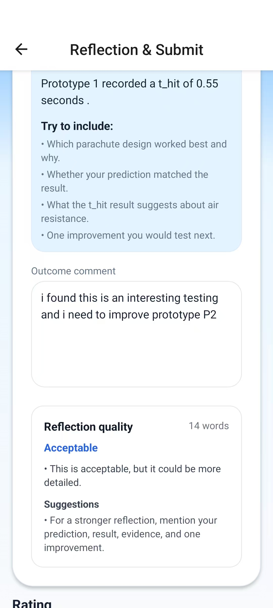 |

| Low-Quality Reflection Detection                                                                     | Repeated Content Detection                                                                              |
|------------------------------------------------------------------------------------------------------|---------------------------------------------------------------------------------------------------------|
| 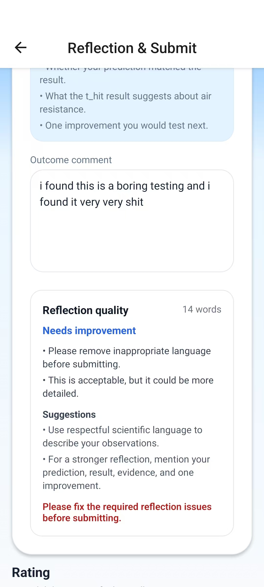 | 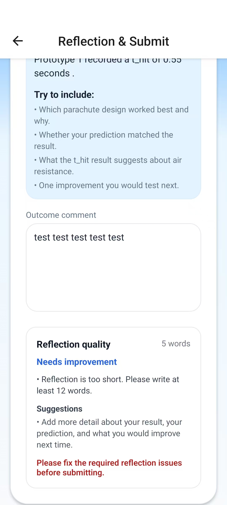 |

#### Offline Synchronization and Recovery

| Offline Draft Recovery                                                            | Synchronization Recovery                                                                     |
|-----------------------------------------------------------------------------------|----------------------------------------------------------------------------------------------|
| 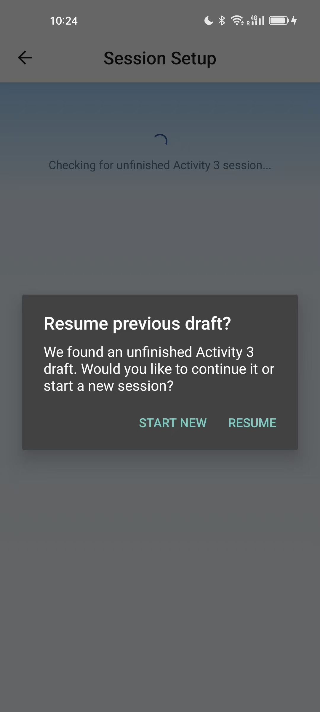 | 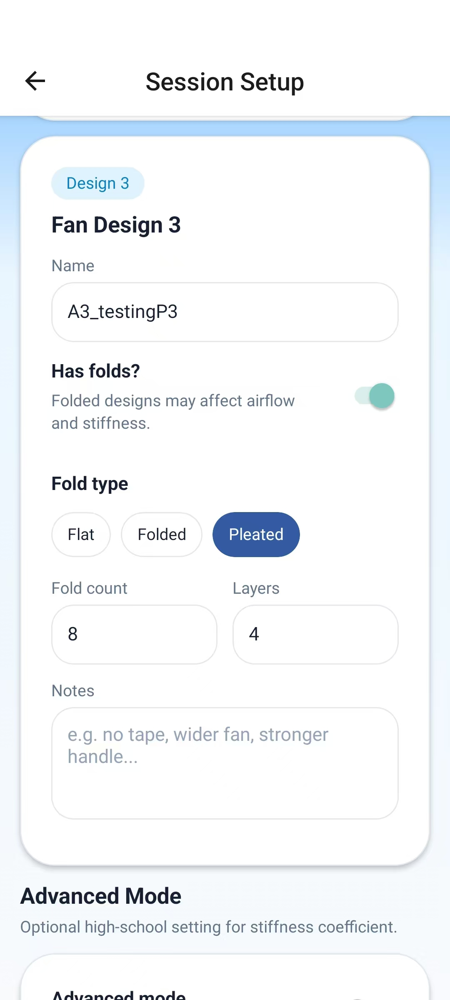 |

| Activity History                                                                        | Team Up                                                                   |
|-----------------------------------------------------------------------------------------|---------------------------------------------------------------------------|
| 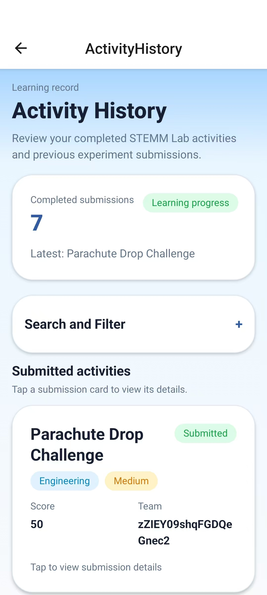 | 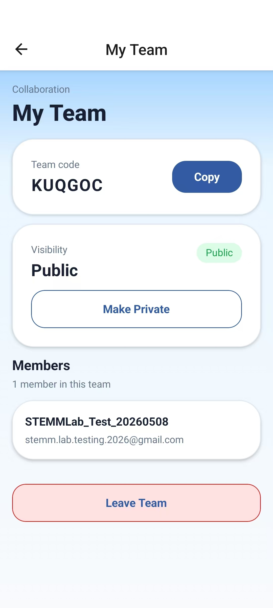 |

#### Administrative and Learning Analytics Interfaces

| Admin Dashboard                                           | Activity Management                                                         |
|-----------------------------------------------------------|-----------------------------------------------------------------------------|
| 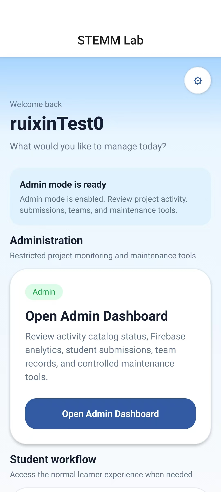 | 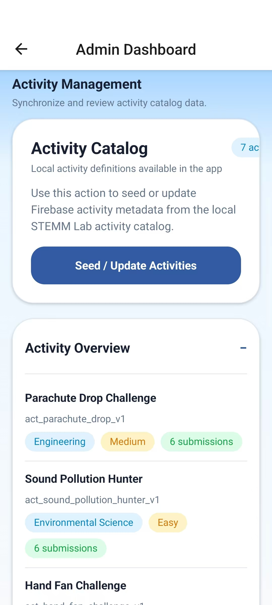 |

| Leaderboard                                                                                    | Profile and Account Management                                                   |
|------------------------------------------------------------------------------------------------|----------------------------------------------------------------------------------|
| 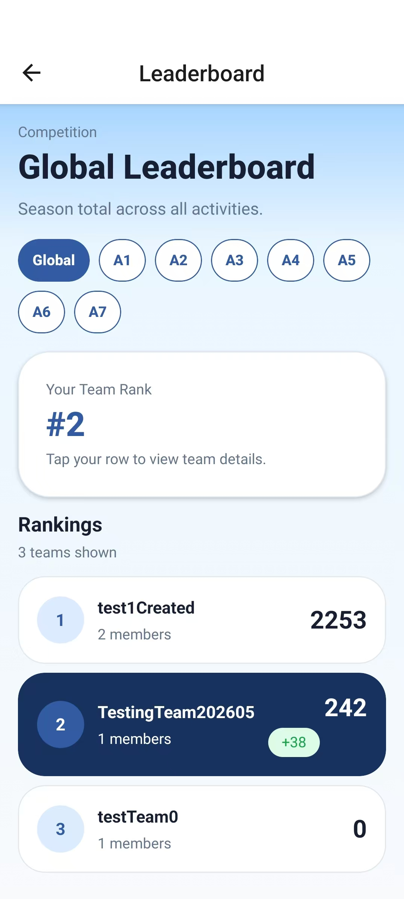 | 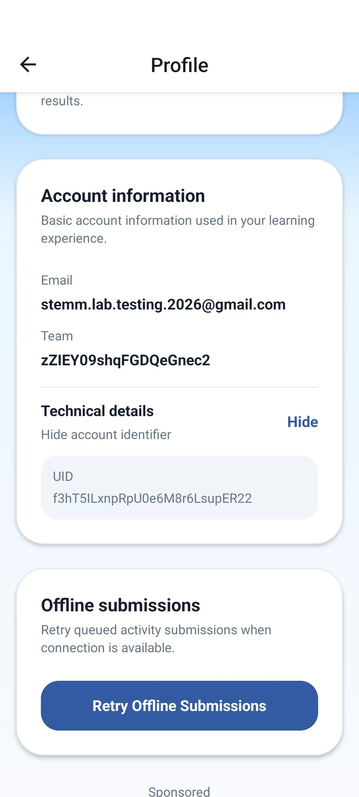 |

---

### Engineering Architecture

STEMM Lab was designed as a modular mobile software system rather than a screen-only prototype. The architecture
separates user interface rendering, application state, business logic, persistence, synchronization, cloud services, and
runtime device operations into maintainable layers.

The overall system architecture is summarized below.

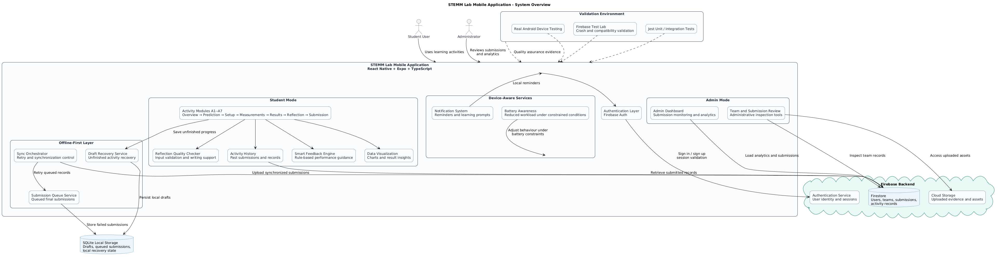

#### Offline-First Persistence Layer

The application uses SQLite as a local persistence layer to protect user progress during unstable network conditions.
This layer supports unfinished activity drafts, local measurement records, queued submissions, and synchronization
recovery.

This design allows students to continue experimental workflows even when Firebase is temporarily unavailable.

#### Firebase Cloud Infrastructure

Firebase provides the primary cloud backend for authentication, synchronized data storage, uploaded evidence files, and
cloud-based validation.

The Firebase integration includes:

| Firebase Service        | Usage                                                           |
|-------------------------|-----------------------------------------------------------------|
| Firebase Authentication | User login, registration, session identity, protected access    |
| Cloud Firestore         | Activity metadata, submissions, teams, users, analytics records |
| Firebase Storage        | Uploaded experimental evidence such as media files              |
| Firebase Test Lab       | Android compatibility and runtime validation                    |

#### Synchronization and Runtime Orchestration

The synchronization subsystem coordinates SQLite persistence, Firebase upload workflows, offline queue recovery, network
availability, and retry behavior.

Instead of blocking the user interface during long-running operations, synchronization tasks execute asynchronously
while the application remains responsive. This is particularly important for media uploads, offline submission recovery,
notification scheduling, and background retry workflows.

#### Educational Analytics and Feedback

STEMM Lab includes rule-based educational feedback and visualization systems that convert raw activity data into
meaningful learning insights.

This includes:

| Subsystem                     | Purpose                                                  |
|-------------------------------|----------------------------------------------------------|
| Visualization Analytics       | Converts measurements into charts and summaries          |
| Smart Performance Feedback    | Generates contextual performance interpretation          |
| Reflection Quality Validation | Detects empty, repeated, or low-quality reflection input |
| Activity History              | Allows users to review completed experiment records      |

---

### Technology Stack

| Layer                  | Technology                                            |
|------------------------|-------------------------------------------------------|
| Mobile Framework       | React Native + Expo                                   |
| Language               | TypeScript                                            |
| Backend Infrastructure | Firebase                                              |
| Authentication         | Firebase Authentication                               |
| Cloud Database         | Cloud Firestore                                       |
| Cloud Storage          | Firebase Storage                                      |
| Local Persistence      | SQLite                                                |
| Navigation             | React Navigation                                      |
| Charts and Analytics   | react-native-gifted-charts                            |
| Notifications          | Expo Notifications                                    |
| Device Services        | Expo Location, Camera, Battery, Notifications         |
| Testing                | Jest, React Native Testing Library, Firebase Test Lab |
| Deployment             | Expo Application Services Build                       |
| Project Management     | Jira Agile Scrum                                      |
| Version Control        | Git + GitHub                                          |

---

### STEMM Experimental Modules

The application implements seven complete STEM experimentation modules. Each module follows a guided scientific workflow
from activity introduction to prediction, measurement, analysis, reflection, submission, synchronization, and historical
review.

| Activity | Description                                   |
|----------|-----------------------------------------------|
| A1       | Parachute Drop Experiment                     |
| A2       | Environmental and Sound Measurement           |
| A3       | Camera-Based Experimental Recording           |
| A4       | Sensor and Device Interaction                 |
| A5       | Data Visualization and Analytics              |
| A6       | Smart Performance Analysis                    |
| A7       | Integrated Reflection and Submission Workflow |

Each activity supports:

- activity overview and learning guidance,
- prediction and hypothesis workflows,
- setup procedures,
- trial-based measurements,
- analytical results,
- reflection submission,
- cloud synchronization,
- offline recovery behavior,
- and activity history tracking.

---

### Mobile Device Integration

STEMM Lab integrates real mobile device capabilities to support context-aware experimentation and realistic mobile
learning workflows.

| Capability          | Usage                                                       |
|---------------------|-------------------------------------------------------------|
| Camera              | Experimental evidence capture                               |
| Microphone          | Sound-based measurement activities                          |
| GPS and Maps        | Environmental and location-based activities                 |
| Local Notifications | Activity reminders and workflow continuity                  |
| Storage Permissions | Media persistence and upload preparation                    |
| Battery Monitoring  | Resource-aware runtime behavior                             |
| AdMob Test Banners  | Controlled advertising integration for non-critical screens |

| Location Services                                                               | Notification Workflow                                         |
|---------------------------------------------------------------------------------|---------------------------------------------------------------|
| 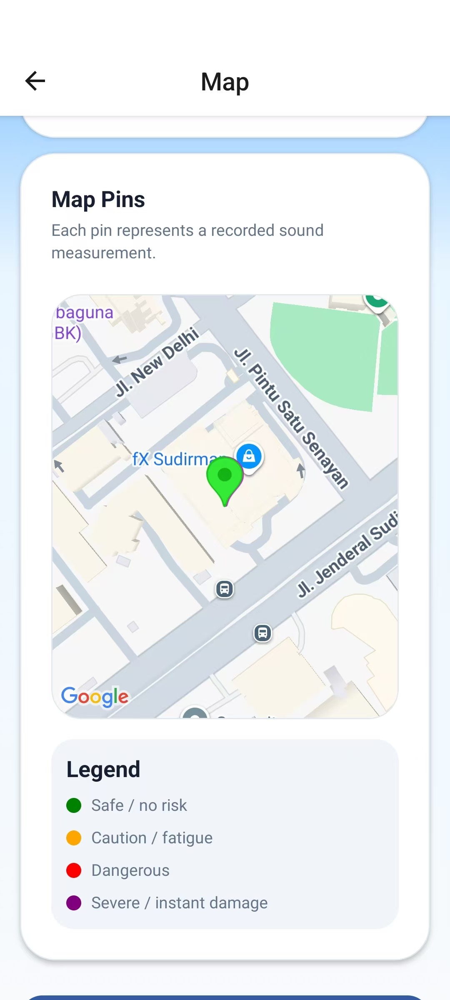 | 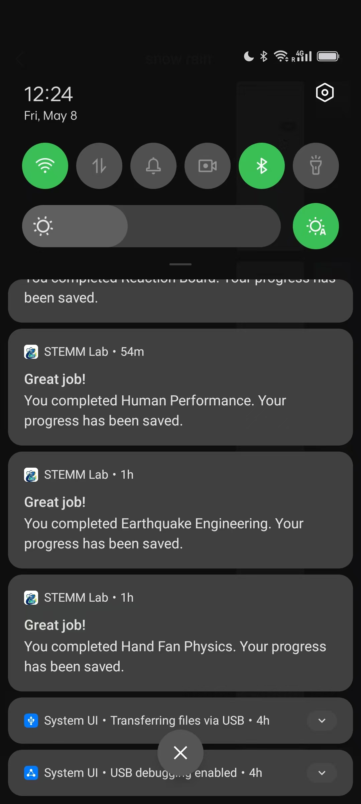 |

| Battery Awareness                                  | Camera Permission                                                                                |
|----------------------------------------------------|--------------------------------------------------------------------------------------------------|
| 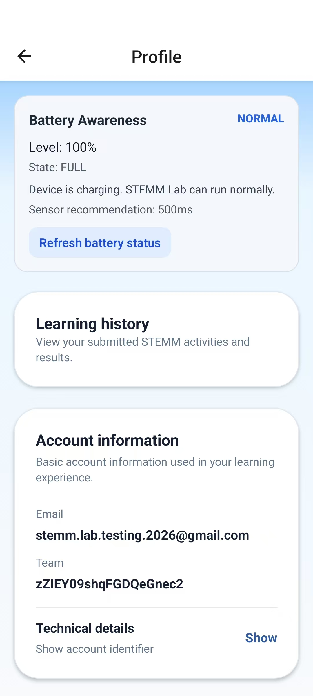 | 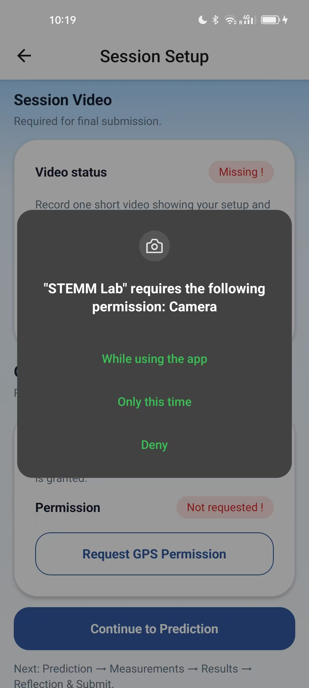 |

---

### Asynchronous Runtime Coordination

One of the major engineering features of STEMM Lab is its coordination of multiple asynchronous runtime services during
normal mobile execution.

The application may simultaneously manage:

- Firebase synchronization,
- SQLite persistence,
- offline queue recovery,
- notification scheduling,
- media uploads,
- battery-awareness monitoring,
- network availability checks,
- and UI state updates.

For example, when a student completes an activity without stable internet access, the submission can be serialized into
SQLite while the UI continues responding normally. When connectivity is restored, the queued record is uploaded
asynchronously to Firestore without requiring the user to repeat the activity.


---

### Testing and Quality Assurance

STEMM Lab was validated using a multi-layer testing approach covering automated tests, integration behavior, real-device
execution, Firebase synchronization, and Android deployment workflows.

| Testing Layer                | Purpose                                                                     |
|------------------------------|-----------------------------------------------------------------------------|
| Unit Testing                 | Validates isolated services and utilities                                   |
| Integration Testing          | Checks interaction between app modules                                      |
| E2E Workflow Testing         | Validates full activity workflows from start to submission                  |
| Firebase Integration Testing | Confirms Authentication, Firestore, Storage, and sync behavior              |
| Firebase Test Lab            | Provides cloud-hosted Android validation                                    |
| Real-Device Testing          | Confirms permissions, sensors, storage, notifications, and runtime behavior |

#### Testing Evidence

| Jest Test Execution                                                          | Coverage Analysis                                                           |
|------------------------------------------------------------------------------|-----------------------------------------------------------------------------|
| 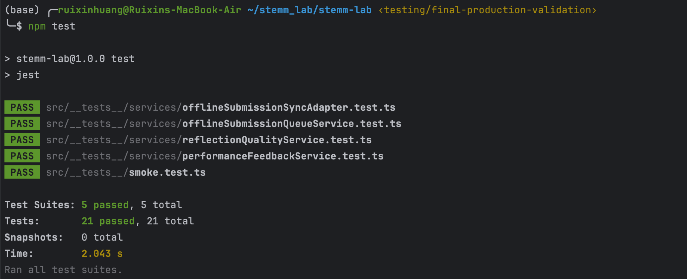 | 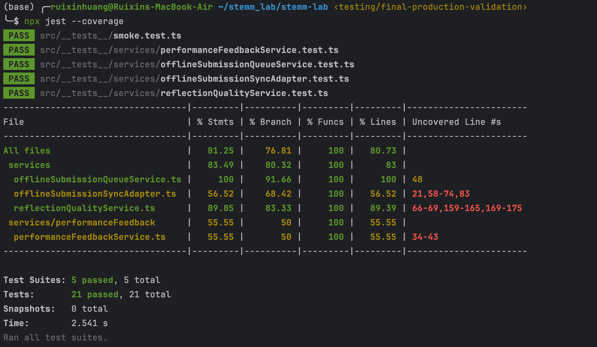 |

| Android Build Validation                                               | ADB Device Testing                                                       |
|------------------------------------------------------------------------|--------------------------------------------------------------------------|
| 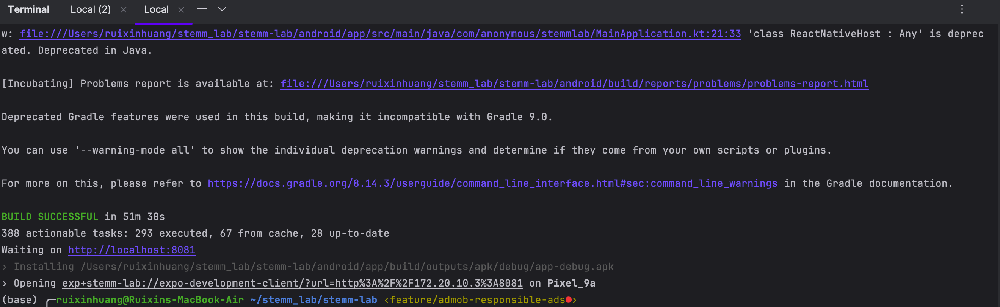 | 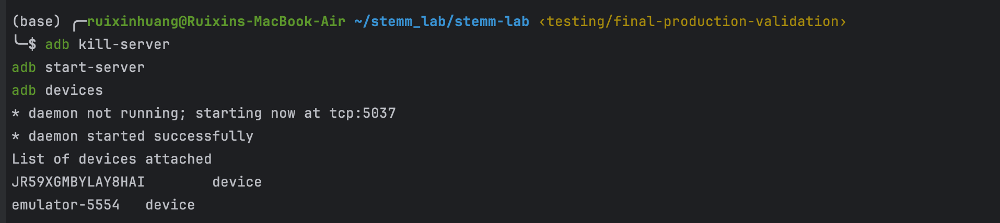 |

---

### Deployment Pipeline

The application uses Expo Application Services for Android APK generation and deployment validation.

#### Build Command

```bash
eas build -p android --profile preview
```

#### Deployment Workflow

```text
Local validation
    ↓
GitHub synchronization
    ↓
EAS cloud build
    ↓
APK signing and packaging
    ↓
Physical Android installation
    ↓
Runtime validation
```

| EAS Build Workflow                                              | Real Device Execution                                                                    |
|-----------------------------------------------------------------|------------------------------------------------------------------------------------------|
| 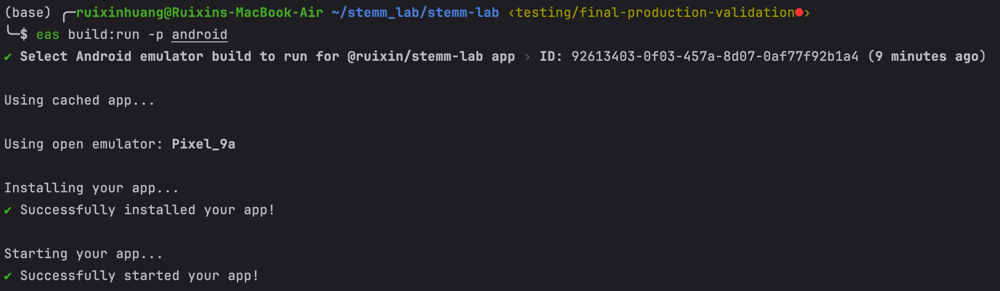 | 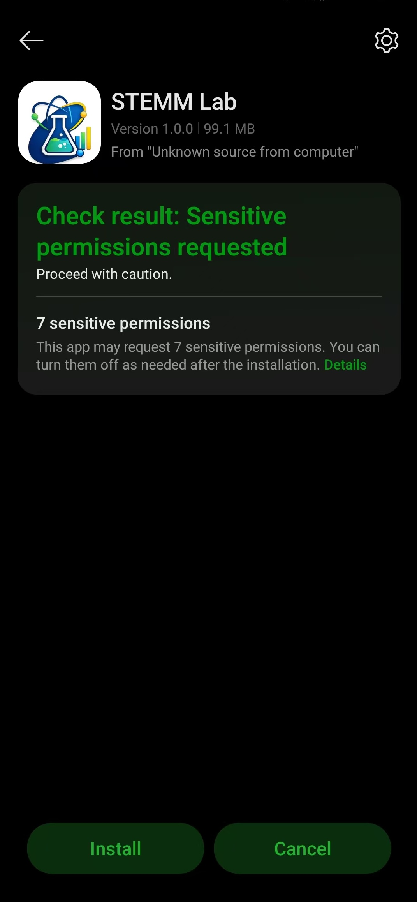 |

---

### Agile Development Workflow

The project was developed independently using an Agile Scrum-inspired workflow. Development was organized through
sprints, feature branches, incremental commits, testing validation, and controlled integration.

Dedicated feature branches were used for major engineering systems including:

| Feature Area        | Development Focus                                    |
|---------------------|------------------------------------------------------|
| Offline Persistence | SQLite draft recovery and offline records            |
| Synchronization     | Queued Firebase synchronization                      |
| Analytics           | Visualization and result insights                    |
| Feedback            | Smart performance feedback and reflection validation |
| Notifications       | Reminder scheduling and recovery workflows           |
| Battery Awareness   | Resource-conscious mobile execution                  |
| UI System           | Reusable React Native design components              |
| Deployment          | EAS build and Android validation                     |

This workflow improved traceability, reduced integration risk, and supported maintainable development across a large
independent mobile application codebase.

---

### Build Instructions

Install dependencies:

```bash
npm install
```

Start the Expo development server:

```bash
npx expo start
```

Generate Android preview build:

```bash
eas build -p android --profile preview
```

## Author

Ruixin Huang

Production-oriented mobile software engineering project integrating React Native, Firebase cloud infrastructure, SQLite
offline persistence, asynchronous synchronization workflows, and context-aware STEM educational computing.